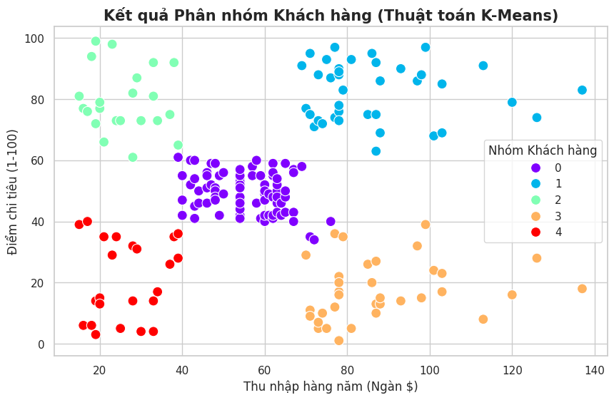
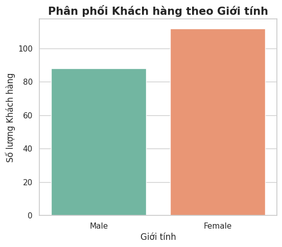
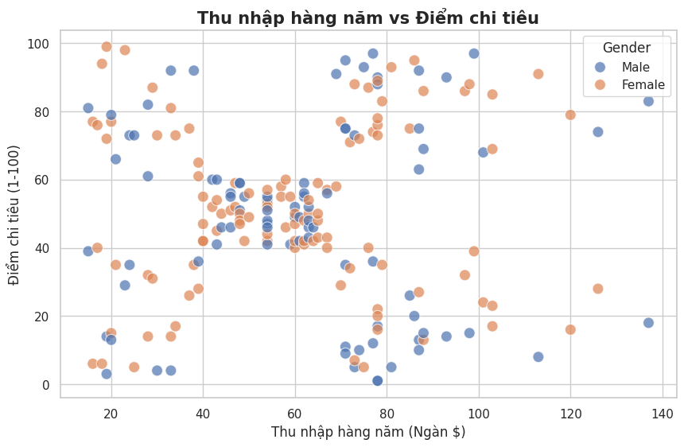

# Phân tích Hành vi và Phân nhóm Khách hàng (Customer Segmentation)

## 📌 Tổng quan dự án (Project Overview)
Trong môi trường bán lẻ đầy cạnh tranh, việc thấu hiểu khách hàng là chìa khóa để tối ưu hóa doanh thu. Dự án này ứng dụng quy trình phân tích dữ liệu và thuật toán Học máy không giám sát (Unsupervised Machine Learning) để giải quyết bài toán cốt lõi: **Phân khúc khách hàng (Customer Segmentation)**. 

Bằng cách phân tích hành vi mua sắm dựa trên Thu nhập hàng năm (Annual Income) và Điểm chi tiêu (Spending Score), hệ thống tự động nhận diện và phân loại khách hàng thành các nhóm đặc thù. Kết quả của dự án giúp phòng Marketing đưa ra các chiến dịch cá nhân hóa, tối ưu chi phí quảng cáo và nâng cao trải nghiệm khách hàng.

## 📊 Dữ liệu sử dụng (Dataset)
* **Nguồn:** Thư viện Kaggle (Mall Customer Segmentation Data).
* **Quy mô:** Bao gồm thông tin chi tiết của hàng trăm khách hàng thành viên.
* **Đặc trưng chính (Features):** Giới tính (Gender), Tuổi (Age), Thu nhập hàng năm (Annual Income), Điểm chi tiêu (Spending Score - được đánh giá bởi siêu thị dựa trên hành vi mua sắm và số tiền chi trả).

## 🛠️ Công nghệ & Thuật toán (Tech Stack)
* **Ngôn ngữ lập trình:** Python (Triển khai trên Google Colab).
* **Xử lý & Làm sạch dữ liệu:** `pandas`, `numpy`.
* **Trực quan hóa dữ liệu (EDA):** `matplotlib`, `seaborn` (Sử dụng Scatter plot, Count plot để phân tích phân phối giới tính và mối quan hệ giữa các biến).
* **Thuật toán Machine Learning:** * **K-Means Clustering:** Thuật toán phân cụm mạnh mẽ giúp gom nhóm các điểm dữ liệu có đặc tính tương đồng.
  * Phương pháp Elbow (Tùy chọn) để xác định số lượng cụm (k) tối ưu.

## 💡 Phân tích Chuyên sâu & Đề xuất (Key Insights & Recommendations)
Dựa trên thuật toán K-Means (k=5), tệp khách hàng được chia thành 5 nhóm chiến lược với các đặc điểm và đề xuất tiếp thị tương ứng:

1. **Nhóm Khách hàng VIP (Thu nhập cao, Chi tiêu cao):** * *Đặc điểm:* Là nguồn thu chính của siêu thị.
   * *Đề xuất:* Tập trung chăm sóc đặc biệt, giới thiệu các sản phẩm cao cấp, phiên bản giới hạn hoặc các đặc quyền thẻ thành viên VIP.
2. **Nhóm Khách hàng Tiết kiệm (Thu nhập cao, Chi tiêu thấp):** * *Đặc điểm:* Có năng lực tài chính nhưng đang e dè trong việc chi tiêu.
   * *Đề xuất:* Thiết kế các chương trình khuyến mãi chéo (Cross-selling), combo giảm giá hoặc khảo sát để tìm hiểu thêm nhu cầu thực sự của họ.
3. **Nhóm Khách hàng Tiêu xài (Thu nhập thấp, Chi tiêu cao):** * *Đặc điểm:* Rất thích mua sắm dù tài chính không quá dư dả.
   * *Đề xuất:* Gửi thông báo về các chương trình Flash Sale, mua trả góp 0% hoặc các mặt hàng xu hướng giá cả phải chăng.
4. **Nhóm Khách hàng Đại trà (Thu nhập trung bình, Chi tiêu trung bình):** * *Đặc điểm:* Nhóm khách hàng phổ thông, mua sắm theo nhu cầu cơ bản.
   * *Đề xuất:* Giữ chân bằng các chương trình tích điểm đổi quà, voucher giảm giá định kỳ.
5. **Nhóm Khách hàng Ít tiềm năng (Thu nhập thấp, Chi tiêu thấp):** * *Đặc điểm:* Nhạy cảm về giá và ít đến siêu thị.
   * *Đề xuất:* Hạn chế ngân sách tiếp thị cho nhóm này để tối ưu hóa ROI.

## 🖼️ Hình ảnh Demo 
Dưới đây là biểu đồ trực quan hóa kết quả phân cụm bằng thuật toán K-Means, thể hiện rõ rệt 5 nhóm khách hàng trên không gian 2 chiều (Thu nhập vs Điểm chi tiêu):

### 1. Phân phối giới tính khách hàng

### 2. Mối quan hệ giữa Thu nhập và Chi tiêu

### 3. Kết quả Phân nhóm tự động (K-Means Clustering)

## 🚀 Cấu trúc thư mục
* `Customer_Segmentation.ipynb`: Toàn bộ mã nguồn Python thực hiện quá trình làm sạch, EDA và mô hình hóa K-Means.
* `Mall_Customers.csv`: Tập dữ liệu gốc chứa thông tin khách hàng.
